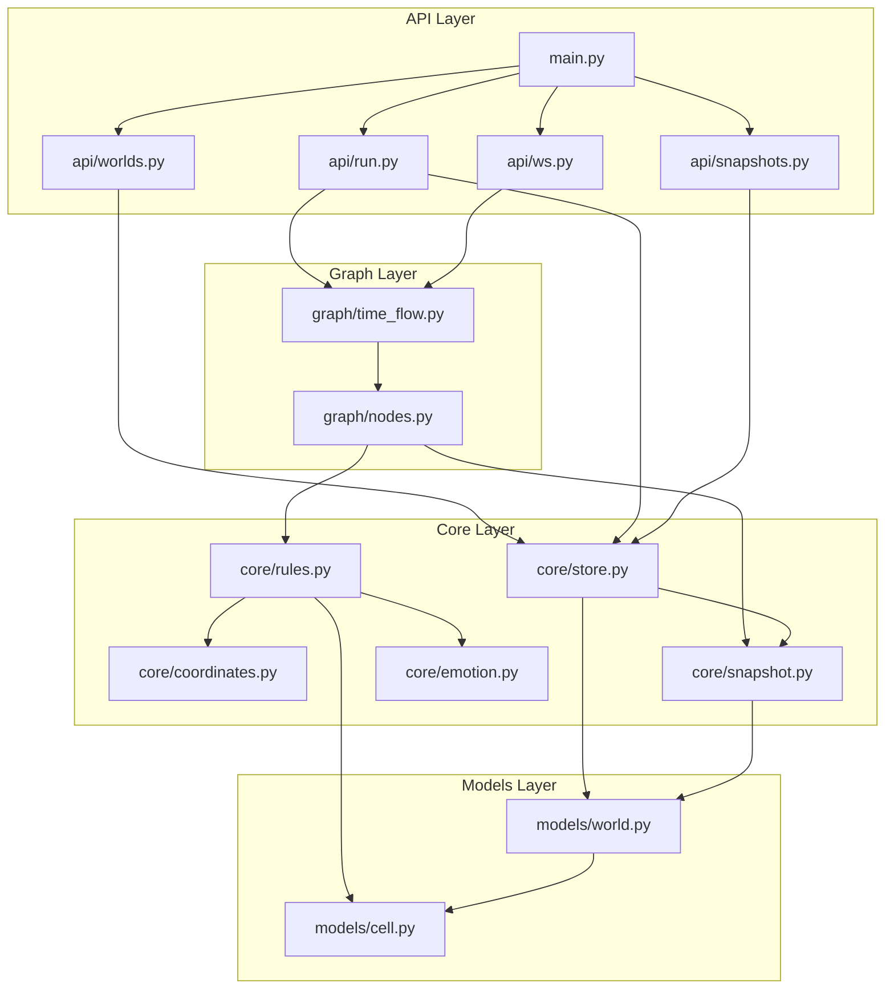
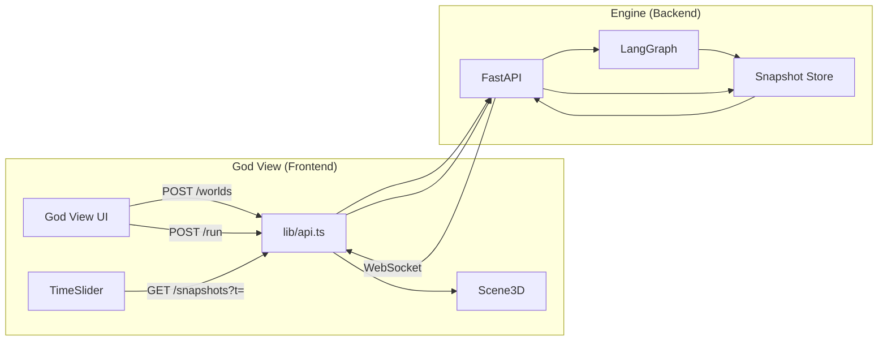

# Organic4D — 아키텍처 고려사항

> IMPLEMENTATION.md에서 다루지 않은 구조·설계 검토사항

---

## 0. 핵심 = 엔진, 제품으로도 사용 가능

**핵심 코어는 엔진.** 아래 아키텍처는 엔진(코어)을 기준으로 한다.  
엔진 + God View를 합친 형태는 **제품 그 자체로 바로 사용 가능**하다.

| 구분 | 엔진 책임 | 제품(엔진+UI) 사용 시 |
|------|-----------|------------------------|
| 공간 분할, t 스냅샷, God View API | ○ | 그대로 포함 |
| 멀티테넌시, 과금 | — | 별도 제품 레이어에서 구현 가능 |
| world_id 격리 | ○ | 기본 제공 |

→ 제품으로 써도 되고, 엔진만 임베드해도 된다. **중심은 엔진**.

---

## 0.5 흐름도 (Flow Diagrams)

> 새 파일 추가 시 해당 Phase 다이어그램 업데이트. doc-sync 룰 참조.

### 레이어 의존성 (백엔드)



### 데이터 흐름 (E2E)



### Phase별 파일 맵

```mermaid
flowchart LR
    subgraph P0["Phase 0"]
        P0_backend["engine/backend/"]
        P0_frontend["engine/frontend/"]
        P0_docker["docker-compose.yml"]
    end

    subgraph P1["Phase 1"]
        cell["models/cell.py"]
        coords["core/coordinates.py"]
        world["models/world.py"]
        rules["core/rules.py"]
        test_rules["tests/test_rules.py"]
    end

    subgraph P2["Phase 2"]
        time_flow["graph/time_flow.py"]
        nodes["graph/nodes.py"]
        snapshot["core/snapshot.py"]
        run_sim["scripts/run_simulation.py"]
    end

    subgraph P3["Phase 3"]
        main["app/main.py"]
        api_worlds["api/worlds.py"]
        api_run["api/run.py"]
        api_ws["api/ws.py"]
        api_snapshots["api/snapshots.py"]
    end

    P0 --> P1
    P1 --> P2
    P2 --> P3
```



### 파일 참조 (Phase 1~2 기준)

| 파일 | 참조하는 파일 |
|------|---------------|
| `core/rules.py` | `models/cell.py`, `core/coordinates.py` |
| `core/coordinates.py` | `models/cell.py` |
| `models/world.py` | `models/cell.py` |
| `graph/time_flow.py` | `models/cell.py`, `core/snapshot.py`, `graph/nodes.py` |
| `graph/nodes.py` | `core/rules.py` |
| `core/snapshot.py` | `models/world.py`, `models/cell.py` |
| `core/store.py` | `models/world.py`, `core/snapshot.py` |
| `scripts/run_simulation.py` | `graph/time_flow.py`, `core/snapshot.py` |
| `api/worlds.py` | `core/store.py` |
| `api/run.py` | `core/store.py`, `graph/time_flow.py` |
| `api/snapshots.py` | `core/store.py` |
| `api/ws.py` | `core/store.py`, `core/ws_manager.py` |

---

## 1. 4D 공간 & 시뮬레이션 아키텍처

### 1.1 공간 분할 (Spatial Partitioning)

| 이슈 | 내용 | 검토 옵션 |
|------|------|-----------|
| **인접 검색** | 융합·영양분 흡수 시 "가까운 세포" 조회 | Octree, Grid, KD-Tree로 (x,y,z,t) 공간 분할 |
| **복잡도** | N개 세포 전수 조회 → O(N²) | 공간 인덱스로 O(N log N) 또는 O(N)에 근접 |
| **구현** | 2D Grid → 3D Grid → 4D Grid (t별로 3D 슬라이스) | 초기에는 단순 거리 정렬, 규모 커지면 도입 |

### 1.2 t별 스냅샷 vs 전체 히스토리

| 전략 | 장점 | 단점 |
|------|------|------|
| **t별 스냅샷** | 특정 t로 즉시 점프 가능, 시각화 최적화 | 저장량 증가 (t_max × 세포 수) |
| **델타 저장** | t 간 변화분만 저장 → 용량 절감 | 과거 t 복원 시 순차 재계산 필요 |
| **샘플링** | t=0,100,200,... 만 저장 | 중간 t는 보간 또는 재실행 |

**권장**: POC는 t별 전체 스냅샷, 규모 커지면 델타 + 샘플링 혼합.

### 1.3 시뮬레이션 실행 모드

| 모드 | 용도 | 특성 |
|------|------|------|
| **동기 (실시간)** | God View에서 즉시 반응 | t 스텝마다 WebSocket 전송, 느리면 UX 저하 |
| **비동기 (백그라운드)** | 장기 시뮬레이션 (t_max 크면) | Celery/RQ로 워커에서 실행, 완료 시 알림 |
| **하이브리드** | t < 100은 실시간, 이후 백그라운드 | 초반 상호작용 → 이후 백그라운드 풀링 |

---

## 2. 데이터 & 스토리지 아키텍처

### 2.1 시계열 데이터

| 요구사항 | 옵션 | 비고 |
|----------|------|------|
| t별 세포 수, 에너지 합계 등 집계 | TimescaleDB, InfluxDB | 시계열 쿼리 최적화 |
| 단순 저장 | PostgreSQL + `t` 인덱스 | 초기에는 충분 |
| 시뮬레이션 결과 아카이브 | Parquet, S3 | 재분석·재시각화용 |

### 2.2 세포 상태 저장 구조

```
World (world_id, t_max, created_at)
  └── Snapshot (world_id, t, created_at)
        └── Cell (cell_id, x, y, z, t, energy, gene_vec, memory_ref, emotion_vec, thought_vec, worldview_vec)
```

- `memory_ref`: Zep/Redis 세션 ID 또는 메모리 키
- 벡터는 pgvector 별도 테이블 또는 JSONB

### 2.3 영양분·이벤트 입력

| 유형 | 저장 | 처리 |
|------|------|------|
| 초기 영양분 | World 설정에 JSON | t=0부터 적용 |
| God View 주입 | `(t_inject, event_type, payload)` | 해당 t 도달 시 엔진에 주입 |
| 정책·뉴스 스트림 | 큐 또는 테이블 | t에 매핑해서 영양분 변환 |

---

## 3. 이벤트 & 메시지 아키텍처

### 3.1 세포 간 상호작용

| 방식 | 설명 | 적합 상황 |
|------|------|-----------|
| **동기 폴링** | 매 t에 모든 세포 상태를 읽고 규칙 적용 | 단일 프로세스, 세포 수 적을 때 |
| **이벤트 기반** | 분열·사멸·융합을 이벤트로 발행 | 분산·확장 시 |
| **현재 권장** | 단일 프로세스 + 메모리 내 상태 | POC, 단일 노드 |

### 3.2 God View 주입 경로

```
[UI: t=500, "정책 A 주입"]
    → WebSocket / REST
    → Backend: 주입 이벤트 큐에 push
    → 시간 엔진: t=500 도달 시 이벤트 적용
    → WebSocket으로 "주입 반영됨" 브로드캐스트
```

- **실시간 재실행**: t=500 이후를 버리고 주입 반영 후 다시 시뮬레이션
- **포워드만**: t=500에서 주입, 이후 t만 새로 계산 (과거 t는 유지)

### 3.3 실시간 브로드캐스트

| 대상 | 채널 | 용도 |
|------|------|------|
| 시뮬레이션 진행률 | WebSocket per session | t, 세포 수, 주요 이벤트 |
| 다중 사용자 (SaaS) | Room/Channel per world_id | 같은 세계를 여러 명이 관찰 |
| 알림 | SSE 또는 WebSocket | 장기 시뮬 완료 알림 |

---

## 4. 규모 확장 (Scaling)

### 4.1 세포 수·t 확장

| 구간 | 전략 |
|------|------|
| ~1K 세포, t~1K | 단일 프로세스, 메모리 내 처리 |
| ~10K 세포 | 공간 분할, 벡터 검색 최적화, LLM 호출 배치 |
| ~100K+ 세포 | 공간 샤딩 (영역별 워커), 분산 큐 |

### 4.2 수평 확장

| 컴포넌트 | 확장 방식 |
|----------|-----------|
| API | 로드밸런서 + 여러 FastAPI 인스턴스 |
| 워커 | Celery/RQ 워커 N개, 시뮬레이션 job 분산 |
| DB | PostgreSQL 읽기 리플리카, Connection pooling |

### 4.3 비용 vs 성능 트레이드오프

- **세포 수 cap**: 분열 시 상한 도달하면 분열 중단 → emergent는 유지하면서 연산 제한
- **t 스텝 스킵**: Thought 10~50t, Worldview 200t+ 조건부. Emotion은 매 t (규칙 기반)
- **시각화 샘플링**: 3D에 전부가 아닌 일부만 렌더 (공간·에너지 기반)

---

## 5. 멀티테넌시 (SaaS)

> **엔진 관점**: `world_id` 기반 격리만 제공. 사용자·과금·할당량은 **제품 레이어**에서 처리.

### 5.1 엔진이 제공하는 격리

| 수준 | 방식 | 비고 |
|------|------|------|
| **world_id** | 모든 리소스가 world에 종속 | 엔진 API의 기본 단위 |
| **API 키** | 엔진 호출 시 인증 (선택) | 제품이 발급·관리 |
| **캐시** | `{world_id}` 네임스페이스 | Redis key 분리 |

### 5.2 제품 레이어에서 처리 (엔진 외부)

| 항목 | 내용 |
|------|------|
| 사용자·조직 | JWT, 세션, tenant_id |
| 동시 실행 제한 | 사용자당 N개 |
| 스토리지 할당량 | 월드당 t_max, 세포 수 상한 (플랜별) |
| 과금 | 제품 비즈니스 로직 |

---

## 6. 대안 아키텍처

### 6.1 경량화 (MVP)

| 기존 | 경량 대안 | 이유 |
|------|-----------|------|
| PostgreSQL | SQLite | 단일 파일, 설정 없음, POC에 적합 |
| Zep/Redis | 메모리 dict + 파일 직렬화 | 의존성 최소화 |
| Celery | in-process, 별도 스레드 | 초기에는 큐 불필요 |
| Docker Compose 4서비스 | backend + frontend 2개만 | 로컬 실행 간소화 |

### 6.2 풀스택 (프로덕션)

- PostgreSQL + Redis + Celery + TimescaleDB (선택)
- 모니터링: Prometheus + Grafana
- 로그: 구조화 로그 + ELK/Loki
- API 게이트웨이: Kong, AWS API Gateway (인증·레이트리밋)

### 6.3 모노레포 vs 멀티레포

| 방식 | 장점 | 단점 |
|------|------|------|
| **모노레포** | 공유 타입·유틸, 일괄 빌드, PR 통합 | 구조 복잡 |
| **멀티레포** | backend/frontend 독립 배포 | 타입·스키마 동기화 수동 |
| **권장** | 모노레포 (backend, frontend, shared) | 초기에는 단순함 우선, 규모 커지면 shared 추가 |

---

## 7. 최적화 전략 (Optimization)

> 규모 커졌을 때를 대비해 미리 준비해 둘 전략

### 7.1 렌더링 최적화 (3D 시각화)

| 전략 | 내용 | 적용 시점 |
|------|------|-----------|
| **GPU Instancing** | 동일 메시(Sphere)를 InstancedMesh로 한 번에 그리기 → draw call 1회 | 세포 수 1K+ |
| **LOD (Level of Detail)** | 줌 아웃 시 저폴리곤/포인트 클라우드, 줌 인 시 개별 메시 | 세포 수 10K+ |
| **Frustum Culling** | 화면 밖 세포 렌더 스킵 (Three.js 기본) | 항상 |
| **스냅샷 스트리밍** | t별 (x,y,z)만 전송, 프론트에서 InstancedMesh 업데이트 | WebSocket 전송량 절감 |
| **시각화 샘플링** | 3D에 표시할 세포 수 cap (예: 상위 2K개만, 에너지·공간 기반) | 10K+ 세포 |

### 7.2 메모리 최적화

| 영역 | 전략 | 내용 |
|------|------|------|
| **백엔드** | t별 스냅샷 델타화 | 변경된 세포만 저장 |
| **백엔드** | 벡터 압축 | 유전자·Thought·Worldview 벡터 float32 → int8 또는 16차원 등 |
| **백엔드** | 메모리 풀링 | 세포 객체 재사용, GC 부담 감소 |
| **프론트** | 가상화 | t 슬라이더 구간 밖 데이터 lazy load |
| **프론트** | TypedArray | InstancedMesh attribute에 Float32Array 직접 사용 |

### 7.3 연산 최적화

| 영역 | 전략 | 내용 |
|------|------|------|
| **인접 검색** | 공간 분할 (1.1 참고) | Octree, Grid → O(N²) → O(N log N) |
| **벡터 유사도** | 배치 연산 | 융합 조건 계산 시 한 번에 cosine similarity |
| **5대 규칙** | 불필요 연산 스킵 | 에너지 0 근처이면 성장 스킵, 거리 멀면 융합 후보 제외 |
| **병렬화** | 멀티프로세싱 | t 스텝 내 규칙 적용을 영역별로 분할 (Python multiprocessing) |

### 7.4 LLM·임베딩 최적화

| 전략 | 내용 | 효과 |
|------|------|------|
| **조건부 호출** | Thought 10~50t, Worldview 200t+ 또는 메모리 100+ | 호출 수 90%+ 감소 가능 |
| **배치 처리** | 여러 세포 메모리를 한 번에 LLM에 전달 | API 라운드트립 감소 |
| **캐싱** | 동일 메모리 요약 → 캐시된 Thought·Worldview 벡터 반환 | 중복 호출 제거 |
| **작은 모델** | Ollama + 3B/7B (IMPLEMENTATION 참고) | 지연·비용 최소화 |

### 7.5 네트워크·API 최적화

| 전략 | 내용 | 적용 |
|------|------|------|
| **WebSocket 압축** | per-message deflate | 스냅샷 JSON 전송량 감소 |
| **디바운스** | t 슬라이더 드래그 시 100ms 간격으로만 요청 | API 호출 수 감소 |
| **증분 전송** | 전체가 아닌 변경분만 전송 (델타) | 대역폭 절감 |
| **캐싱** | t별 스냅샷 클라이언트 캐시 | 재방문 시 재요청 없음 |

### 7.6 최적화 적용 우선순위

| 단계 | 항목 | 트리거 |
|------|------|--------|
| POC | 기본 구조, 단순 구현 | — |
| 1차 | GPU Instancing, t 델타 저장 | 세포 500+ 또는 t 500+ |
| 2차 | 공간 분할, LLM 조건부 호출 | 세포 2K+ |
| 3차 | LOD, 시각화 샘플링, 벡터 압축 | 세포 10K+ |
| 4차 | 멀티프로세싱, 분산 | 세포 50K+ |

---

## 8. 검토 우선순위

| 순위 | 아키텍처 | 시점 |
|------|----------|------|
| 1 | t별 스냅샷 vs 델타, 시뮬레이션 모드 (동기/비동기) | POC 설계 단계 |
| 2 | 공간 분할 (인접 검색) | 세포 수 1K 넘을 때 |
| 3 | God View 주입 경로, WebSocket 구조 | God View 구현 시 |
| 4 | **최적화 전략 (7장)** | 세포 500+ 또는 체감 지연 발생 시 |
| 5 | 멀티테넌시, 규모 확장 | SaaS 전환 시 |
| 6 | 시계열 DB, 분산 워커 | 10K+ 세포 목표 시 |

---

*문서 버전: v0.2 — 최적화 전략 섹션 추가*
